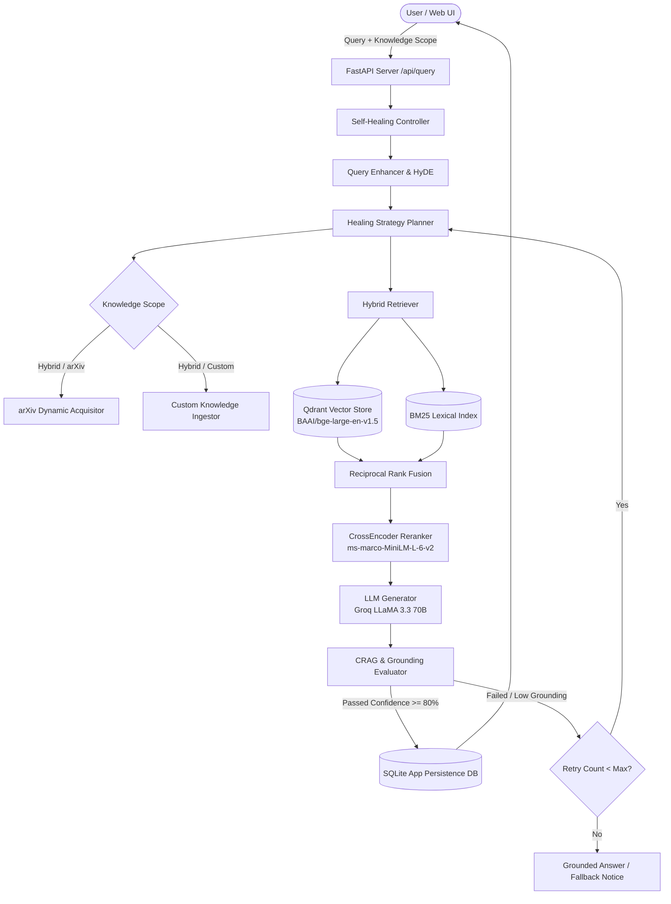

<div align="center">

# 🤖 Autonomous Self-Healing Research Assistant

**Enterprise-Grade Multi-User RAG Platform with Closed-Loop Diagnostics & Multi-Source Scope Control**

[](https://python.org)
[](https://fastapi.tiangolo.com)
[](https://qdrant.tech)
[](https://groq.com)
[](https://docker.com)
[](https://opensource.org/licenses/MIT)

</div>

---

## 📖 Overview

The **Autonomous Self-Healing Research Assistant** is an advanced Retrieval-Augmented Generation (RAG) platform built for enterprise environments. It directly addresses the most common failure modes of LLMs—hallucinations and poor context retrieval—by implementing a **closed-loop self-healing architecture**.

When the system detects that an answer lacks sufficient grounding in the retrieved documents, it autonomously triggers a healing cycle: rewriting queries, adjusting retrieval parameters, or dynamically acquiring new research from external sources until a high-confidence, fully grounded answer is produced.

## ✨ Key Features

- **🔄 Closed-Loop Diagnostics**: Autonomous CRAG (Corrective RAG) validation continuously monitors output quality. Low-confidence responses automatically trigger dynamic query expansion and re-retrieval.
- **🌐 Multi-Source Knowledge Scopes**: Seamlessly toggle between searching **Hybrid** (all sources), **Custom Uploads Only**, or **arXiv Papers Only**.
- **⚡ Ultra-Low Latency Inference**: Pre-configured for **Groq's Cloud API (LLaMA 3.3 70B)** delivering sub-second generation, with native fallback to local Ollama.
- **📄 Enterprise Ingestion Pipeline**: Instant, incremental vector indexing for PDFs, DOCX, Markdown, Code, CSVs, and JSON logs without requiring full database rebuilds.
- **📊 Rich Telemetry Dashboard**: A modern, glassmorphism-styled web interface providing real-time visibility into system health, intent detection, grounding confidence, and execution audits.
- **🔒 Secure Multi-User Sessions**: Built-in authentication (FastAPI + SHA-256) and SQLite persistence ensure isolated chat histories and localized telemetry tracking per user.

---

## 🏗️ Architecture & Workflow

The platform operates on a sophisticated multi-stage pipeline designed for accuracy and resilience.

### Step-by-Step Workflow

1. **Intent & Enhancement (Input Stage)**
   - A user submits a query. The system detects the underlying intent and applies **HyDE (Hypothetical Document Embeddings)** and query decomposition to enrich the search terms.
   
2. **Knowledge Scope Filtering**
   - The user selects their desired knowledge boundary (e.g., only search custom uploaded PDFs, or search everything).

3. **Hybrid Retrieval (Search Stage)**
   - The query hits the **Qdrant Vector Database** (Dense Retrieval via `BAAI/bge-large-en-v1.5`) and the **BM25 Lexical Index** (Sparse Retrieval) simultaneously.
   - Results are merged using **Reciprocal Rank Fusion (RRF)** to balance semantic meaning with exact keyword matching.

4. **Cross-Encoder Reranking**
   - The fused results are scored and re-ordered using a fine-tuned cross-encoder (`ms-marco-MiniLM-L-6-v2`) to ensure only the most highly relevant chunks make it to the LLM context window.

5. **Generation & CRAG Validation**
   - The **Groq LLaMA 3.3 70B** model generates an initial answer.
   - A separate grounding evaluator analyzes the answer against the retrieved context. 
   - *If Confidence ≥ 80%*: The answer is delivered to the user.
   - *If Confidence < 80%*: The **Self-Healing Controller** takes over.

6. **Self-Healing Loop (Recovery Stage)**
   - The system analyzes the failure (e.g., "Missing Context").
   - It plans a recovery strategy: expanding keywords, dropping noisy chunks, or executing a dynamic fetch to arXiv for missing literature.
   - The pipeline re-runs autonomously until the output passes validation or max retries are exhausted.

### System Diagram



---

## 🚀 Getting Started

### Prerequisites
- Python 3.11+
- Free [Groq API Key](https://console.groq.com) (for ultra-fast cloud LLM inference)
- Docker & Docker Compose (Optional, for containerized deployment)

### 1. Local Installation

```bash
# Clone the repository
git clone https://github.com/YOUR_USERNAME/self-healing-rag.git
cd self-healing-rag

# Create and activate a virtual environment
python -m venv venv
source venv/bin/activate  # On Windows use: venv\Scripts\activate

# Install required dependencies
pip install -r requirements.txt
```

### 2. Configuration

Create a `.env` file in the root of the project:

```ini
# Core LLM Configuration (Groq LLaMA 3.3)
GROQ_API_KEY=gsk_your_groq_api_key_here
GROQ_MODEL=llama-3.3-70b-versatile

# Server Settings
HOST=0.0.0.0
PORT=8000
LOG_LEVEL=INFO
```

### 3. Running the Server

Start the FastAPI application with auto-reloading enabled:

```bash
python main.py
```
*Navigate to `http://localhost:8000` to access the Web UI.*

---

## 🐳 Docker Deployment

For a production-ready, isolated environment, use Docker Compose:

```bash
# Build and start the container stack in detached mode
docker-compose up -d --build

# View real-time application logs
docker-compose logs -f
```

---

## 📡 API Reference

The platform exposes a fully documented REST API. Access the interactive Swagger UI at `http://localhost:8000/docs`.

| Endpoint | Method | Description |
| :--- | :--- | :--- |
| `/api/query` | `POST` | Execute Intent-Aware RAG with Self-Healing & Scope Control |
| `/api/upload` | `POST` | Ingest and incrementally index custom documents (PDF, CSV, Code) |
| `/api/auth/register` | `POST` | Register a new user account |
| `/api/auth/login` | `POST` | Authenticate user and issue session token/API key |
| `/api/sessions` | `GET` | Retrieve session history for the authenticated user |
| `/api/telemetry` | `GET` | Fetch global system health, query volumes, and pass rates |
| `/api/health` | `GET` | General system health and configuration diagnostic |

---

## 🛠️ Configuration & Customization

Advanced tuning parameters are located in `configs/config.yaml`. Key sections include:

- **Chunking Strategy**: Modify `chunk_size` and `chunk_overlap`.
- **Retrieval Engine**: Configure top-$k$ limits, distance metrics, and vector dimensions.
- **Self-Healing Thresholds**: Adjust `max_retries` and `confidence_threshold` (default is 0.80).

---

## 🤝 Contributing

Contributions are welcome! If you have suggestions for improvements, new features, or bug fixes:
1. Fork the Project
2. Create your Feature Branch (`git checkout -b feature/AmazingFeature`)
3. Commit your Changes (`git commit -m 'Add some AmazingFeature'`)
4. Push to the Branch (`git push origin feature/AmazingFeature`)
5. Open a Pull Request

## 📄 License

This project is distributed under the MIT License. See `LICENSE` for more information.
